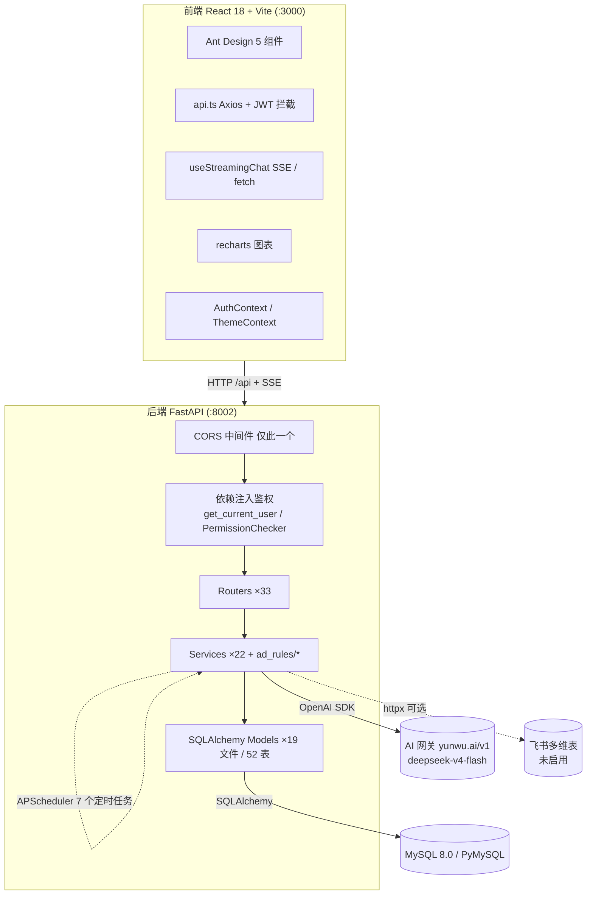

# 宝鑫华盛AI助手 (AIBXHS) · Code Wiki

> 跨境电商 AI 智能运营平台 · 结构化代码文档
> 文档生成/更新于：**2026-08-07**（基于真实代码交叉核对，修正了旧文档中过时的技术栈/端口/运行命令）

---

## 1. 项目概述

**宝鑫华盛AI助手 (AIBXHS)** 是一个面向跨境电商（亚马逊为主，兼容 eBay / Walmart / Shopify / Shopee / Lazada / TikTok / Temu 等）卖家的 AI 智能运营平台。平台通过导入业务数据 + AI 分析，为电商团队提供运营决策支持。

**核心业务模块：**

| 模块 | 业务价值 |
|------|---------|
| **库存机器人 (Inventory Bot)** | 导入 FBA 库存快照，按可配置权重公式计算日均销量，预警断货/冗余，生成补货决策（红/黄/绿风险）与分货（红单/海运）测算 |
| **差评机器人 (Review Bot)** | 同步商品评论，AI 分析情感与核心问题，按重要性分级（高/中/低），支持 AI 翻译与话术建议 |
| **邮件机器人 (Email Bot)** | 邮件跟进管理，AI 自动生成回复，未跟进/待办聚合 |
| **广告机器人 (Ad Bot)** | 监控分析广告活动/关键词/搜索词/商品投放，规则引擎自动产出优化建议（降竞价/加否词/调预算），支持 AI 建议与健康分 |
| **仓储物流 (WMS)** | 采购 → 入库 → 出库 → 挪货 → 发货 → 盘点 全链路，批次(FIFO)库存管理与操作审计日志 |
| **AI 聊天助手 (Chat Bot)** | 双模式（差评/库存）AI 对话，Function Calling 联动业务数据，SSE 流式响应 |
| **多租户 + RBAC** | `tenant_id` 数据隔离 + 部门-用户 + 角色-权限细粒度控制 |
| **数据看板 (Dashboard)** | 销售趋势、库存分布、预警概况、差评监控等聚合视图 |

> ⚠️ **重要更正**：仓库根目录 `README.md` 已严重过时（写着 `Node.js + Express + MongoDB + node-cron`），与真实的 **Python(FastAPI) + MySQL** 技术栈完全不符。**本 Wiki 以实际代码为准，请勿引用根 README 的技术栈章节。**

---

## 2. 技术栈与版本（实测）

### 2.1 后端（`backend/requirements.txt`，全部锁定版本）

| 分类 | 依赖 | 版本 |
|------|------|------|
| Web 框架 | `fastapi` | 0.109.0 |
| ASGI 服务器 | `uvicorn[standard]` | 0.27.0 |
| ORM | `sqlalchemy` | 2.0.25 |
| 数据库驱动 | `pymysql` | 1.1.0 |
| 数据校验/配置 | `pydantic` / `pydantic-settings` | 2.5.3 / 2.1.0 |
| 表单解析 | `python-multipart` | 0.0.6 |
| 认证 | `python-jose[cryptography]`（JWT）/ `passlib[bcrypt]`（密码哈希，**实际用 pbkdf2_sha256**） | 3.3.0 / 1.7.4 |
| AI SDK | `openai` | 1.10.0 |
| 定时任务 | `apscheduler` | 3.10.4 |
| HTTP 客户端 | `httpx` | 0.26.0 |
| 数据处理 | `pandas`（间接带 `numpy`）/ `openpyxl`（Excel） | 2.2.0 / 3.1.2 |
| Markdown | `marko` | 2.1.0 |
| 环境变量 | `python-dotenv` | 1.0.0 |
| 测试 | `pytest`（未声明，由 `tests/` 目录使用） | — |

> 说明：`numpy` 被 `inventory_service.py` 直接使用，由 pandas 间接引入；`pytest` 用于 `tests/`。

### 2.2 前端（`frontend/package.json`，声明 vs 实装）

| 依赖 | 声明 | 实装 |
|------|------|------|
| react / react-dom | ^18.2.0 | 18.3.1 |
| react-router-dom | ^6.22.0 | 6.30.3 |
| antd | ^5.12.0 | 5.29.3 |
| axios | ^1.6.5 | 1.15.2 |
| recharts | ^2.10.3 | 2.15.4 |
| dayjs | ^1.11.10 | 1.11.20 |
| lucide-react | ^0.300.0 | 0.300.0 |
| react-resizable | ^3.1.3 | 3.1.3 |
| vite / typescript（dev） | ^5.0.8 / ^5.2.2 | 5.4.21 / 5.9.3 |
| eslint（dev） | ^8.55.0 | — |

> ⚠️ **构建脆弱点**：`@ant-design/icons` 在几乎所有页面被直接 import，但**未声明在 `package.json` 中**，目前仅作为 antd 的传递依赖可用。若改用 pnpm 或 antd 移除该依赖，构建将失败。

---

## 3. 项目整体架构

### 3.1 架构总览



### 3.2 目录结构

```text
AIBXHS/
├── backend/                         # 后端 FastAPI（123 个 .py，不含 __pycache__）
│   ├── main.py                      # 应用入口：注册路由/中间件、startup 初始化、uvicorn 启动
│   ├── config.py                    # Settings(BaseSettings)，读取 .env
│   ├── dependencies.py              # JWT 鉴权依赖 + PermissionChecker(RBAC)
│   ├── database/                    # engine / SessionLocal / Base / init_db()
│   ├── models/                      # SQLAlchemy ORM（19 文件，52 张表）
│   ├── routers/                     # 33 个 API 路由控制器
│   ├── schemas/                     # Pydantic Schema（仅 chat_schemas.py）
│   ├── services/                    # 业务逻辑层（22 文件 + ad_rules/ 子模块）
│   ├── utils/                       # excel_reader / security / store_mapping
│   ├── scripts/                     # 一次性运维/调试脚本（8 .py + SQL）
│   ├── migrations/                  # 手写 DDL 迁移（无 Alembic，4 脚本）
│   ├── tests/                       # pytest 单元测试（12 文件，偏广告模块）
│   ├── static/                      # 前端构建产物挂载点（index.html）
│   └── requirements.txt
├── frontend/                        # 前端 React（src/ 49 个源文件，另含 node_modules/dist）
│   ├── index.html                   # HTML 入口，挂载 #root
│   ├── vite.config.ts               # 端口 3000，/api 代理 → :8002
│   ├── tsconfig*.json
│   └── src/
│       ├── main.tsx                 # React 入口：ThemeProvider→ConfigProvider→AuthProvider→App
│       ├── App.tsx                  # BrowserRouter + 扁平 Routes + ProtectedRoute
│       ├── api.ts                   # 集中式 Axios 封装（1107 行，31 个 API 模块）
│       ├── contexts/                # AuthContext / ThemeContext
│       ├── hooks/                   # useStreamingChat（SSE 消费）
│       ├── components/              # MainLayout / ProtectedRoute / ThemeSwitcher / MarkdownRenderer
│       ├── pages/                   # 22 个业务页面 + AdBot/ 子模块（10 Tabs）
│       └── index.css                # 全局样式（antd 覆盖 + 主题 CSS 变量）
├── database/                        # 数据库 DDL 与迁移备份
│   ├── schema.sql                   # ⚠️ 历史 v1 DDL（16 表，已非权威）
│   ├── drop_inventory_tables.sql
│   └── migrations/                  # 手写迁移 + JSON 备份/回滚（部分硬编码生产库凭据）
├── inventory.py                     # ⚠️ 独立补货原型（自带 DB 配置，非生产代码）
├── _reset_ids.py                    # 运维：重编号补货表主键（高危）
├── _verify_gross_margin.py          # 校验：inventory_snapshots.gross_margin 列
├── 广告活动数据.xlsx / 关键词数据.xlsx / 搜索词数据.xlsx / 商品投放数据.xlsx / 广告数据.xlsx  # 广告生产样本
├── 分货公式模板.xlsx                # 分货算法口径基准
├── 广告机器人.mm                    # 广告模块思维导图（数据来源/字段解析规则）
├── README.md                       # ⚠️ 已过时，技术栈描述错误
├── CHANGE_LOG.md                   # 变更日志
└── package.json                    # 根 monorepo 脚本（dev/build/install）
```

---

## 4. 后端详解

### 4.1 应用入口与启动（`backend/main.py`）

- **入口**：`python main.py`（或 `uvicorn main:app --host 0.0.0.0 --port 8002`）。
- **端口**：`settings.PORT`，默认 `8000`，**当前 `.env` 中 `PORT=8002`**；Windows 下强制 `workers=1`。
- **中间件**：**仅注册了 CORS**（`allow_origins=["*"]`）。**没有** JWT/权限/日志中间件——鉴权全部通过 FastAPI `Depends` 在路由层实现。
- **静态资源**：`app.mount("/static", ...)`，根路径 `/` 返回 `static/index.html`（前端构建产物）。
- **启动事件**（`@app.on_event("startup")`）：
  1. `init_db()` —— 显式导入全部模型后 `Base.metadata.create_all()`（失败仅记日志，沿用已有表）。
  2. `init_scheduler()` —— 启动 APScheduler（`BackgroundScheduler`，7 个任务）。

**内联端点**：`GET /api/health`、`GET /api/test-push-notifications`、`GET /api/clear-today-notifications`、`GET /`。

### 4.2 路由注册（Routers ×33）

全部以 `/api` 为前缀。两类注册方式：
- **注册时追加 `/api`**：`inventory`、`reviews`、`dashboard`、`restock`、`emails`、`local-inventory`、`store-mapping`、`ads`、`ad-rules`、`ad-suggestions`、`ad-execution-logs`
- **router 内部已含 `/api`**：`chat`、`auth`、`departments`、`notifications`、`stores`、`store-groups`、`products`、`tenants`、`business-settings`、`inbound`、`outbound`、`purchase`、`inventory-batches`、`operation-logs`、`permissions`、`stock-transfers`、`warehouses`、`inventory-count`、`product-bindings`、`replenishment`、`shipments`

> 完整端点清单见 **§10 附录：模块-文件映射**。

### 4.3 鉴权与权限（RBAC）

- **`dependencies.py`**：`security = HTTPBearer()`；`get_current_user()` 用 `python-jose` 校验 JWT（payload：`sub`/用户名、`uid`/用户ID、`tid`/租户ID），注入租户信息（`_tenant_name` 等）；`PermissionChecker(required_permission)` 先判 `roles.code=='admin'` 放行，否则查 `role_permissions JOIN permissions` 含目标 code，否则 403。
- **`auth_service.py`**：`pwd_context = CryptContext(schemes=["pbkdf2_sha256"])`（**非 bcrypt**）；`create_access_token()`、`authenticate_user()`、`create_user()`（注册时自动建租户 + 初始化 ~90 条权限 + admin 角色）。
- **覆盖度**：`get_current_user` 被 32 个 router 使用；`PermissionChecker` 仅覆盖 11 个 router（products/inbound/replenishment 等），差评/广告/聊天/库存快照等仅登录校验、无细粒度权限。
- 前端 `hasPermission()` 仅控制菜单/按钮显示，**路由本身只校验登录态**，越权拦截依赖后端。

### 4.4 数据库层（`database/database.py`）

- 引擎：`create_engine(settings.DATABASE_URL, poolclass=QueuePool, pool_size=10, max_overflow=20, pool_recycle=1800, pool_pre_ping=True)`。
- `DATABASE_URL` 是 `config.py` 的 **property**（非环境变量直读）：`mysql+pymysql://{user}:{pwd}@{host}:{port}/{db}?charset=utf8mb4`；`DEMO_MODE=True` 切到 `DEMO_DB_*` 配置。
- 每次物理连接执行 `SET NAMES 'utf8mb4' COLLATE 'utf8mb4_unicode_ci'`。
- `init_db()`：**权威建表入口**，由 SQLAlchemy 模型定义 52 张表（`database/schema.sql` 仅 16 表，已过时）。

### 4.5 定时任务（`services/scheduler.py`）

`BackgroundScheduler` 注册 7 个任务：

| Job | 触发 | 状态 |
|-----|------|------|
| `inventory_check` | interval 1h | ⚠️ 空实现（仅日志） |
| `reviews_check` | interval 30m | ⚠️ 空实现（仅日志） |
| `daily_report` | cron 09:00 | ⚠️ 空实现（仅日志） |
| `daily_review_analysis` | cron 07:00 | ✅ 已实现（5 线程并发 + OpenAI） |
| `daily_review_notifications` | cron 08:00 | ✅ 已实现（推送未处理差评） |
| `overdue_purchase_check` | cron 09:00 | ✅ 已实现（>14 天超期采购单） |
| `ad_data_cleanup` | cron 03:00 | ✅ 已实现（7 表分批硬删，委托 `ad_retention_service`） |

### 4.6 关键 Service 类与函数

#### 库存机器人（补货核心）
- **`services/inventory_service.py`**（1952 行，最大 service）
  - 常量：`FIELD_MAPPING`（~50 项中文列名→字段）、`LEAD_TIME=100`（备货周期天数）、`DEFAULT_DAILY_SALES_WEIGHTS={3d:0, 7d:0.2, 14d:0.2, 30d:0.2, 60d:0.2, 90d:0.2}`、`_calculate_daily_sales(df, db)`（按权重算日均销量）。
  - `import_inventory_data(db, file_content, ...)` —— 导入快照（复用 `utils.excel_reader.safe_read_excel` 修复损坏 xlsx）。
  - `_calculate_replenishment_fast(db, df, ...)` —— **NumPy 向量化补货算法**：
    ```
    total_stock     = fba_stock + fba_inbound + local_inventory - inspection_quantity
    future_stock    = fba_stock + fba_inbound + effective_local - inspection_qty
    days_of_supply  = min(total_stock / daily_sales, 365)   # 销量为0则365
    demand          = daily_sales * LEAD_TIME
    suggest_qty     = max(0, demand - future_stock) → 向上取整到 50 的倍数
    risk_level      = 红 if dos<=30 else 黄 if dos<=60 else 绿
    ```
    特殊处理：共享库存子行 demand/建议量归零、风险绿；`daily_sales<=0.1` 建议量归零。
  - `allocate_shipment(db, tenant_id, items, ...)` —— 分货计算（按近 30 天销量/现货/在途，拆分红单/海运分配量，5 倍数取整）。
  - 查询：`get_inventory_overview` / `search_inventory` / `get_stockout_top10` / `get_overstock_top10` / `get_inbound_details` / `export_inventory_to_excel`。
- **`services/inventory_import_service.py`**（584 行）：后台线程异步导入编排，模块级全局 `_import_status` 暴露进度（`GET /api/restock/import-status`）。
- **`services/calculate_service.py`**：补货计算的异步任务包装，按 `task_id` 维护状态（`GET /api/restock/calculate/status/{task_id}`）。
- **`services/inventory_batch.py`**（331 行）：批次库存，**FIFO 扣减**（`deduce_inventory_fifo` / `apply_deduction` / `rollback_deduction` / `generate_batch_number`）。
- **`services/local_inventory_service.py`**：本地仓库存导入与汇总。

#### 广告机器人（规则引擎）
- **`ad_rules/rule_engine.py` → `RuleEngine`**：
  - `RULES = [7 个规则实例]`；`run_all_rules(db, tenant_id, evaluation_date, save_suggestions=True)`：按优先级排序 → 逐条 `evaluate()`（单规则异常隔离）→ **短路去重**（同 `target_type:target_id` 仅留最高优先级）→ 写入 `ad_optimization_suggestion`（`status="待处理"`）→ 返回摘要。
  - `get_rule_metadata()`（供 `GET /api/ad-rules/predefined`）、`get_rule_by_name()`、`_apply_short_circuit()`。
- **`ad_rules/rule_base.py`**：`BaseOptimizationRule(ABC)`（抽象属性 `name/priority/description`、字段 `conditions/actions`、抽象方法 `evaluate()` 返回 `List[RuleResult]`）；`RuleResult` 数据类。
- **`ad_rules/rules/`**（7 个规则，数据源 `ad_report_snapshots`，`report_type=="campaign"`）：
  | 规则类 | 触发 | 门槛 |
  |--------|------|------|
  | `AcosTooHighRule` | acos > 0.30 | spend ≥ 10 |
  | `RoasTooLowRule` | roas < 2.5 | spend ≥ 10 |
  | `CtrLowRule` | ctr < 0.002 | impressions ≥ 1000 |
  | `CpcTooHighRule` | cpc > 1.5 | clicks ≥ 10 |
  | `CvrTooLowRule` | cvr < 0.05 | clicks ≥ 20 |
  | `BudgetUnderSpendRule` | budget 利用率 < 0.50 | budget ≥ 30 |
  | `BudgetUtilizationLowRule` | 利用率 < 0.50 | — |
- **`ad_rules/constants.py`**：`RuleThresholds`（7 规则默认阈值）、`HealthScoreThresholds`（6 维度分档）。
- **`ad_import_service.py`**（931 行）：Excel 报表导入，`_detect_report_type()` 按列名自动识别 campaign/keyword/search_term/product，双写 `ad_report_snapshots` + 对应日表，导入后自动触发 `RuleEngine.run_all_rules`。
- **`ad_service.py`**：查询聚合（`get_ad_overview` / `search_ad_data` / `get_ad_performance_trend` / `get_keyword_analysis` / `get_search_term_analysis` / `export_ad_data`）。
- **`ad_ai_service.py`**：`generate_ad_suggestions()` / `execute_optimization_rules()`（AI 建议、否词/调价/预算）。
- **`ad_health_score.py` → `AdHealthScoreService`**：6 维度打分（acos/roas/ctr/cvr/budget_util/cpc），`_safe_float` 处理 NaN/Infinity。
- **`ad_retention_service.py`**：`cleanup_expired_data(db, tenant_id)`（7 表分批硬删），供 scheduler 与 `/api/ads/retention/*`。
- **`ad_ingestion_service.py` → `AdIngestionService`**：RPA 数据批量 upsert（`POST /api/ads/sync/rpa`）。

#### AI 聊天与流式
- **`services/chat_service.py`**（2461 行，第二大文件）：
  - OpenAI 客户端模块级构建（`settings.OPENAI_API_KEY` 为空则 `None`）。
  - 工具定义：`DATE_PARSING_TOOLS` / `INVENTORY_TOOLS` / `ALL_TOOLS`（Function Calling）。
  - 数据工具：`query_inventory_status()` / `query_negative_reviews()` / `query_reviews_unified()` / `find_product()`。
  - 差评分析：`get_review_analysis()` / `analyze_review()` / `batch_analyze_reviews()`。
  - 单据自动创建（AI 意图执行）：`classify_order_intent_with_ai()` / `try_execute_ai_order_intent()` / `create_purchase_order()` / `create_replenishment_order()` / `create_inbound_order()`。
  - 会话：`save_message()` / `get_conversation_history()` / `create_session_id()`。
  - 主入口：`process_chat(db, user_id, session_id, user_message, chat_type)`。
- **`services/streaming_service.py`**（767 行）→ `StreamingService`：
  - `stream_chat_response_lightweight(...)`：异步生成器，yield SSE（`start`/`content`/`thinking`/`done`/`error`）。
  - **lightweight 变体要点**：每次 DB 操作按需 `SessionLocal()` 并立即 close，避免 SSE 长连接占用连接池；工具调用遇 `429`/`Connection error` **降级为普通流式回复**。
  - `SEMAPHORE` 并发控制见 `services/ai_concurrency.py`（`AI_MAX_CONCURRENT_CALLS=3`，`AI_CALL_SEMAPHORE = BoundedSemaphore(3)`）。
- **`routers/chat.py`**：`POST /api/chat`（线程池 `AI_THREAD_POOL` 调 `process_chat`）、`POST /api/chat/stream`（`StreamingResponse` SSE）、`/chat/search`、`/chat/export`、`/chat/sessions/*`。

#### 其他服务
| 文件 | 关键函数 | 用途 |
|------|---------|------|
| `translate_service.py` | `translate_text()` / `translate_review()` | 评论翻译（OpenAI） |
| `feishu_service.py` | `get_access_token()` / `fetch_inventory_from_feishu()` / `fetch_reviews_from_feishu()` | 飞书多维表读写（**async/httpx，当前凭据为空未启用**） |
| `feishu_sync_service.py` | `fetch_feishu_inbound_data_fast()` / `start_sync_async()` | 飞书在途货件同步 |
| `excel_helper.py`（984 行） | `create_*_excel_template()` / `parse_*_excel()` | 全站 Excel 模板与解析 |
| `operation_log.py` | `write_log()` + 12 个语义封装 | 统一写 `operation_logs` |
| `utils/excel_reader.py` | `repair_xlsx_filter()` / `safe_read_excel()` | 修复损坏 autoFilter 后读 Excel |
| `utils/store_mapping.py` | `get_inventory_account()` / `get_store_mapping_from_db()` | 店铺名 ↔ 库存别名映射 |

---

## 5. 前端详解

### 5.1 入口与 Provider 嵌套（`src/main.tsx`）

```
React.StrictMode
└── ThemeProvider (contexts/ThemeContext)
    └── ThemedApp
        └── ConfigProvider (antd, locale=zhCN, token.colorPrimary=当前主题)
            └── AntdApp (antd App，message/modal 上下文)
                └── AuthProvider (contexts/AuthContext)
                    └── App (BrowserRouter + Routes)
```

- **无 Redux / Zustand / TanStack Query**，全局态仅靠 2 个 Context。
- 全局中文化：`import zhCN from 'antd/locale/zh_CN'`。

### 5.2 路由（`src/App.tsx`）

扁平 `<Routes>`，**无嵌套路由/Outlet/懒加载**，受保护路由手动包 `<ProtectedRoute><MainLayout>...</MainLayout></ProtectedRoute>`。

| 路径 | 组件 | 权限码 |
|------|------|--------|
| `/login` `/register` | Login / Register | 公开 |
| `/` `/dashboard` | Dashboard | 登录 |
| `/todo` | Home（菜单名"KPI"，命名不一致） | 登录 |
| `/chat` | ChatBot | 登录 |
| `/inventory` | InventoryBot | `robot:inventory:view` |
| `/review` | ReviewBot | `robot:review:view` |
| `/email` | EmailBot | `robot:email:view` |
| `/ads` | AdBot（`pages/AdBot/index.tsx`，10 Tabs） | `robot:ad:view` |
| `/products` | ProductManagement | `product:view` |
| `/org` `/permissions` `/operation-logs` `/tenants` `/business-settings` `/stores` | 系统设置类 | 各自 `org:view`/`permission:view`/`log:view`/`robot:inventory:settings`/`store:view` |
| `/replenishment` `/purchase` `/inbound` `/outbound` `/stock-transfer` `/shipment` `/warehouses` | WMS 类 | 各自 `:view` 码 |
| `/inventory/allocate-test` | AllocateShipmentTest（测试页，不在菜单） | 登录 |

> 无 `path="*"` 兜底路由（未知 URL 显示空白）；`/tenants`（公司设置）菜单项**无 `hasPermission` 校验**（与其他系统项不一致）。

### 5.3 API 层（`src/api.ts`，1107 行）

- 实例：`axios.create({ baseURL: "/api", timeout: 180000 })`，无 `import.meta.env`（生产依赖同源反向代理）。
- 自定义 `paramsSerializer`：数组展开为同名 key 重复追加（`a=1&a=2`），过滤 `undefined`/`null`（配合 FastAPI `List[str]`）。
- **请求拦截器**：注入 `Authorization: Bearer <localStorage.token>`。
- **响应拦截器**：401 时（非登录请求且不在 `/login`）清 token 并 `window.location.href="/login"`（整页刷新式跳转）。
- **31 个 API 模块**（导出对象），如 `authApi`/`inventoryApi`/`adsApi`/`adRulesApi`/`adSuggestionsApi`/`replenishmentOrdersApi`/`chatApi`/`chatStreamApi` 等。文件上传用 `FormData`，导出下载用 `responseType:"blob"`。
- `chatApi.sendMessage` 单独 `timeout: 300000`（5 分钟）；`chatStreamApi.sendMessage` **用原生 fetch**（非 axios）。

> ⚠️ **缺陷**：`pages/AdBot/AdRetention.tsx` 调用 `adsApi.getRetentionStatus()` / `updateRetentionConfig()` / `triggerRetentionCleanup()`，但 `api.ts` 中 `adsApi` **未定义这三个方法**（strict 下类型错误，运行时抛 `is not a function`；因 `build` 不跑 `tsc` 未被拦截）→ "数据保留" Tab 为**损坏功能**。

### 5.4 核心页面（`src/pages/`，22 个）

| 页面 | 文件大小 | 功能 | 主要 API |
|------|---------|------|---------|
| Dashboard | 7K | 看板卡片 + recharts 趋势图 | dashboardApi / inventoryApi / reviewsApi |
| Home (`/todo`) | 30K | KPI/待办聚合（差评/库存/邮件/入库/发货） | reviewsApi / emailsApi / inboundOrdersApi / shipmentsApi |
| ChatBot (`/chat`) | 30K | AI 聊天（**当前走非流式 `chatApi.sendMessage`**） | chatApi |
| InventoryBot (`/inventory`) | 118K | 补货测算/缺货积压Top10/导入导出/飞书同步 | inventoryApi / localInventoryApi |
| ReviewBot (`/review`) | 31K | 差评列表/AI批量分析/分级流转 | reviewsApi |
| EmailBot (`/email`) | 31K | 邮件跟进/AI回复/批量 | emailsApi |
| ProductManagement (`/products`) | 147K | **最大页面**：产品主数据/多平台映射/批量导入/配件绑定/批次库存/盘点 | productsApi 等 |
| AdBot (`/ads`) | Tabs | 概览/活动/关键词/搜索词/产品/建议/规则/日志/导入/保留 | adsApi / adSuggestionsApi / adRulesApi |
| ReplenishmentManagement | 58K | 补货单创建/审批/转采购 | replenishmentOrdersApi |
| PurchaseManagement | 58K | 采购单 CRUD/审批 | purchaseOrdersApi |
| InboundManagement | 77K | 入库/采购差异校验处理 | inboundOrdersApi |
| OutboundManagement | 75K | 出库/批次扣减 | outboundOrdersApi |
| StockTransferManagement | 36K | 挪货/调拨 | stockTransfersApi |
| ShipmentManagement | 18K | 发货管理/KPI | shipmentsApi |
| WarehouseManagement | 9K | 仓库主数据 | warehousesApi |
| StoreManagement | 28K | 店铺/分组/成员授权 | storesApi |
| OrgManagement | 27K | 部门与用户管理 | departmentsApi |
| PermissionManagement | 32K | RBAC 角色/权限 | permissionsApi |
| TenantManagement | 11K | 多租户管理 | tenantsApi |
| OperationLogs | 19K | 操作审计 | operationLogsApi |
| BusinessSettings | 8K | 补货公式权重/日销配置 | businessSettingsApi |

`AdBot/` 子模块 10 个 Tab 组件：`Overview`/`CampaignAnalysis`/`KeywordAnalysis`/`SearchTermAnalysis`/`ProductAnalysis`/`SuggestionManagement`/`RuleConfig`/`ExecutionLogView`/`AdImport`/`AdRetention`；私有组件 `HealthScoreCard`/`RuleThresholdEditor`/`SuggestionStatusTag`。

### 5.5 Hooks 与 Context

- **`hooks/useStreamingChat.ts`**（260 行）：SSE 消费（原生 `fetch` + `ReadableStream`，因需 POST+Authorization 头，不用 `EventSource`）；`requestAnimationFrame` 节流渲染（~60ms/次）降低 Markdown 重解析开销；`AbortController` 可中断。
  > ⚠️ **死代码**：`useStreamingChat` 与 `chatStreamApi` **均无任何调用方**，当前聊天走非流式 `chatApi.sendMessage`。属"已实现未接入"能力。
- **`contexts/AuthContext.tsx`**：`{ user, loading, permissions: string[], isAdmin, hasPermission(code), login, register, logout, refreshUser }`；`isAdmin = user?.role==='admin'`；`hasPermission` 对 admin 直接 true。挂载时读 `localStorage.token` → `authApi.getMe()` + `permissionsApi.getMyPermissions()`。登出清 `sessionStorage` 筛选缓存。
- **`contexts/ThemeContext.tsx`**：内置 **6 套主题**（紫罗兰默认/天空蓝/翡翠绿/珊瑚橙/玫瑰红/青柠绿），`localStorage` 键 `app-theme-index`；写入 CSS 变量 `--theme-primary*` + antd `ConfigProvider.token`（双通道主题）。

### 5.6 状态管理与样式

- **状态**：仅 React Context ×2（Auth/Theme）；服务端数据各页面手写 `useState`+`useEffect`+axios。持久化：`localStorage.token`、`localStorage['app-theme-index']`、`sessionStorage['product_management_session_filters_v1']`。
- **样式**：**无 Tailwind / 无 CSS Modules / 无 styled-components**。三层：① antd + `ConfigProvider` 主题 token；② 全局 `index.css`（reset + 大量 `.ant-*` `!important` 覆盖 + 主题 CSS 变量 `color-mix`）;③ 组件内联 `style={{}}`（页面级主要写法）。
- **图标**：`lucide-react`（导航/语义）+ `@ant-design/icons`（表格/表单操作，未声明依赖）。
- **图表**：`recharts`（确认用于 Dashboard）。**表格增强**：`react-resizable`（ProductManagement 列宽拖拽）。**日期**：`dayjs`。

---

## 6. 数据库设计

### 6.1 选型与连接

- **MySQL 8.0**（InnoDB，`utf8mb4` / `utf8mb4_unicode_ci`）；ORM = SQLAlchemy 2.0.25，驱动 PyMySQL 1.1.0。
- 生产库 `bxhs_ai_assistance`；Demo 库 `bxhs_ai_assistance_demo`（`DEMO_MODE` 切换）。
- 连接池 QueuePool（size=10, max_overflow=20, recycle=1800）。

### 6.2 表清单（共 **52 张**，权威定义在 `backend/models/*.py`）

> ⚠️ `database/schema.sql` 仅 16 张表，是**历史 v1 DDL，已非权威**，仅供存档参考。真实表由 `init_db()` 的 `create_all()` 生成。

| 模块 | 表数量 | 表名 |
|------|-------|------|
| 租户/权限/组织 | 9 | `tenants`, `users`, `roles`, `permissions`, `role_permissions`, `departments`, `user_departments`, `conversation_history`, `business_settings` |
| 店铺/商品 | 3(+1缺口) | `stores`, `products`, `product_bindings`（⚠️ `store_groups` 无模型/DDL，详见 §8） |
| 库存/补货 | 7 | `inventory_snapshots`(宽表), `inbound_shipment_details`, `replenishment_decisions`, `inventory_records`, `inventory_alerts`, `inventory_actions`, `local_inventories` |
| WMS 仓储 | 15 | `purchase_orders`, `purchase_order_items`, `inbound_orders`, `inbound_order_items`, `inventory_batches`, `outbound_orders`, `outbound_order_items`, `stock_transfer_orders`, `stock_transfer_order_items`, `shipment_orders`, `shipment_order_items`, `replenishment_orders`, `replenishment_items`, `warehouses`, `operation_logs` |
| 广告 | 15 | 结构层: `ad_campaigns`/`ad_groups`/`ad_keywords`/`ad_targets`/`ad_product_ads`/`ad_negative_keywords`；日报表: `ad_campaign_daily`/`ad_keyword_daily`/`ad_search_term_daily`/`ad_product_daily`/`ad_optimization_suggestion`/`ad_execution_log`；快照/规则: `ad_report_snapshots`/`ad_optimization_rules`/`ad_optimization_logs` |
| 差评 | 3 | `reviews`, `review_analyses`(1:1), `review_handlings` |

### 6.3 多租户与软删除

- **多租户**：几乎所有业务表首列 `tenant_id` + 索引。两种风格：
  - **强约束**（主流）：`tenant_id = Column(Integer, ForeignKey("tenants.id"), nullable=False, index=True)`。
  - **弱约束**（无 FK，默认 1）：`inventory_snapshots` / `inbound_shipment_details` / `replenishment_decisions` / `local_inventories` / `business_settings` —— 隔离依赖应用层 WHERE 条件（**设计不一致，建议标注**）。
- **软删除**：`BaseModel`（`models/base.py`）为所有继承表注入 `created_at` / `updated_at` / `deleted_at`；查询普遍带 `deleted_at IS NULL`。

### 6.4 核心关系链路

```
tenants
 ├── users ──► roles ──► role_permissions ──► permissions
 ├── departments ──► user_departments ──► users
 ├── stores (department_id, inventory_name, ziniao_account)
 │    ├── products ──► product_bindings (成品↔配件自关联)
 │    ├── reviews ──► review_analyses / review_handlings
 │    └── ad_campaigns ──► ad_groups ──► ad_keywords / ad_targets / ad_product_ads
 ├── inventory_snapshots (快照宽表)
 │    ├── inbound_shipment_details (snapshot_id)
 │    └── replenishment_decisions  (snapshot_id)
 └── store_groups [DDL缺失]
      ├── purchase_orders ──► purchase_order_items ──► products
      ├── inbound_orders ──► inbound_order_items ──► inventory_batches
      ├── inventory_batches ──► outbound_order_items / stock_transfer_order_items
      └── replenishment_orders ──► replenishment_items ──► purchase_orders
```

**关键业务链路**：Excel 库存数据中的店铺名（如 `JeVenis-US`）与系统内店铺名（如 `云南金顺公司` + 站点）不一致，通过 `stores.inventory_name` 字段映射——这是 `database/migrations/` 大量脚本存在的根因（已记录 **63 家店铺**完成 `inventory_name` 别名映射）。

### 6.5 迁移策略（无 Alembic）

- 手写一次性脚本 + JSON 快照备份；时间戳文件名（`<用途>_<YYYYMMDD>_<HHMMSS>`）充当版本标识。
- 幂等检查（`column_exists`/`index_exists`/`CREATE TABLE IF NOT EXISTS`）+ "备份 JSON / 变更明细 JSON / 报告 JSON / 回滚 .py" 四件套。
- 两层：`backend/migrations/`（4 个 ALTER 脚本）；`database/migrations/`（`migrate.py` 独立版负责创建 `departments`/`user_departments`/`notifications` 三表并补列）。

---

## 7. 依赖关系（模块间调用）

### 7.1 后端内调用链

```
Routers (33)  →  Services (22 + ad_rules)  →  Models / DB Session
                               │
                               ├─→ OpenAI SDK (AI 网关)
                               ├─→ APScheduler (定时触发 Services)
                               └─→ httpx → 飞书 (可选, 未启用)
```

- **广告导入链路**：Excel → `ad_import_service` 类型识别 → 写 `ad_report_snapshots` + 日表 → 自动触发 `RuleEngine.run_all_rules` → 写 `ad_optimization_suggestion` → 执行记 `ad_execution_log`。
- **库存补货链路**：Excel → `inventory_import_service`（线程）→ `inventory_service.import_inventory_data` → `calculate_replenishment` → 写 `replenishment_decisions`。
- **AI 聊天链路**：`chat.py` → `chat_service.process_chat` / `streaming_service.StreamingService` → OpenAI + Function Calling 查 `inventory_service`/`reviews`。

### 7.2 前后端契约

- 前端 `api.ts` 的 31 个模块按后端 router 前缀组织，统一信封 `{success, data}`（部分接口如 `getMe` 直接返回实体）。
- 前端 dev 端口 **3000**，`vite.config.ts` 代理 `/api` → `http://localhost:8002`（后端默认端口）。
- **端口更正**：旧文档/CHANGE_LOG 称前端 5173、后端 8000，实际分别为 **3000 / 8002**。

---

## 8. 项目运行方式

### 8.1 环境要求

- Python 3.10+（后端）；Node.js 18+（前端）；MySQL 8.0+。

### 8.2 后端启动

```bash
cd backend
pip install -r requirements.txt

# 配置 backend/.env（关键项）
PORT=8002
DB_HOST=127.0.0.1
DB_PORT=3306
DB_USER=root
DB_PASSWORD=your_db_password
DB_NAME=bxhs_ai_assistance          # 或 DEMO_MODE=True 用 Demo 库
SECRET_KEY=请设为强随机值           # ⚠️ 当前 .env 未设，使用默认值（安全风险）
OPENAI_API_KEY=sk-xxx
OPENAI_API_BASE=https://yunwu.ai/v1   # 对应旧文档 AI_BASE_URL
OPENAI_MODEL=deepseek-v4-flash         # 对应旧文档 AI_MODEL
# FEISHU_* 留空则飞书功能不启用

# 初始化表结构（SQLAlchemy create_all）
python -c "from database.database import init_db; init_db()"

# 启动
python main.py
# 或：uvicorn main:app --host 0.0.0.0 --port 8002
```

> 配置项说明：代码中**没有** `AI_API_KEY/AI_BASE_URL/AI_MODEL`，对应为 `OPENAI_API_KEY/OPENAI_API_BASE/OPENAI_MODEL`；`DATABASE_URL` 是计算属性，不能经环境变量直接覆盖。根 `package.json` 的 `dev:backend` 脚本：`cd backend && python -m uvicorn main:app --reload --port 8002`。

### 8.3 前端启动

```bash
cd frontend
npm install
npm run dev        # Vite，端口 3000，/api 代理到 :8002
npm run build      # 生产构建（⚠️ 仅 vite build，不跑 tsc）
npm run preview    # 预览构建产物
```

> 根 `package.json`：`npm run dev`（concurrently 同启前后端）、`npm run install:all`、`npm run install:py`。

### 8.4 顶层脚本（运维/数据）

| 脚本 | 类型 | 说明 | 风险 |
|------|------|------|------|
| `inventory.py` | 独立原型 | **自带 DB 配置**（硬编码 `localhost/inventory`，读 `补货建议.xlsx`），与 backend 无 import 关系；是补货算法的原始定义（生产逻辑已迁移至 `backend/services/inventory_service.py`） | 低（独立库） |
| `_reset_ids.py` | 运维 | 复用 `backend.database.SessionLocal`，对 `inventory_snapshots` 等 3 表主键连续重编号（临时关外键检查，带备份 CSV） | **高（改主键）** |
| `_verify_gross_margin.py` | 校验 | 复用 `SessionLocal`，只读校验 `inventory_snapshots.gross_margin` 列是否存在 | 无 |

### 8.5 数据资产（Excel）

- **5 个广告 Excel**（广告活动/关键词/搜索词/商品投放/广告数据）：亚马逊后台导出的**生产样本**（约 40MB，含真实 ASIN），用于广告导入功能开发与回归（`tests/` 有专门的类型识别/字段解析测试）。导入时 Excel **无日期列**，日期从文件名或导入参数传入。
- **`分货公式模板.xlsx`**：分货算法（`allocate_shipment`）的**口径基准/业务模板**（22.8KB），对应 `tests/test_allocate_shipment.py`。

---

## 9. 已知问题与技术债（务必关注）

| # | 问题 | 影响 | 建议 |
|---|------|------|------|
| 1 | **`AI_SEMAPHORE` 未定义**（`routers/chat.py:84,103` 使用但全库无定义/导入） | `POST /api/chat/stream` 执行时抛 `NameError` → 500 | 改为使用 `services/ai_concurrency.AI_CALL_SEMAPHORE` |
| 2 | **`.env` 已提交且含明文生产库密码与 OpenAI Key**；`SECRET_KEY` 用默认值 | 严重安全风险 | 移出版本库 + 设强随机 `SECRET_KEY` + 加 `.env` 到 `.gitignore` |
| 3 | **6 个表无 ORM 模型**（`store_groups`/`notifications`/`email_messages`/`platform_products`/`import_records`/`user_stores`），仅裸 SQL | `init_db()` 不会建这些表；`store_groups` 被 6 处 FK 引用却无 DDL（模型-实库漂移） | 补模型或迁移脚本；核实 `stores.group_id` 字段来源 |
| 4 | **`AdRetention.tsx` 调用不存在的 `adsApi` 方法** | "数据保留" Tab 运行时报错，功能损坏 | 在 `api.ts` 补 `getRetentionStatus/updateRetentionConfig/triggerRetentionCleanup` |
| 5 | **`@ant-design/icons` 未声明依赖**（靠 antd 传递） | pnpm/未来 antd 版本可能构建失败 | 加入 `package.json` dependencies |
| 6 | **`build` 脚本不含 `tsc`** | strict 类型错误（如 #4）不阻断构建，隐患累积 | 构建串接 `tsc --noEmit` 或 `vue-tsc` 类检查 |
| 7 | **`useStreamingChat`/`chatStreamApi` 死代码** | 流式聊天能力未接入，当前聊天非流式 | 接入或移除 |
| 8 | **权限覆盖不均** | 差评/广告/聊天等仅登录校验 | 扩大 `PermissionChecker` 覆盖 |
| 9 | **scheduler 3 个 job 空实现** | 库存/差评/日报定时任务无效 | 补充实现 |
| 10 | **导入状态为模块级全局单例**（`inventory_import_service`） | 多租户并发导入互相覆盖；而 `ad_import_service` 已按 `tenant_id` 隔离（两套模式并存） | 统一为租户隔离 |
| 11 | **`database/migrations/` 7 个脚本硬编码生产库凭据** | 凭据泄露风险 | 改为从 `backend/.env` 读取（同 `migrate.py`） |
| 12 | **`run_migration.py` 引用的 `v1_add_departments_notifications.sql` 缺失** | 该脚本不可用 | 修复或删除，功能已由 `migrate.py` 取代 |
| 13 | **SSE 解析未跨 chunk 缓冲半行**（`useStreamingChat`） | TCP 分包截断时该帧被静默丢弃 | 增加半行缓冲 |

---

## 10. 附录：模块-文件映射速查

**后端 Routers → 职责**

| Router 文件 | 前缀 | 职责 |
|------------|------|------|
| `auth.py` | `/api/auth` | 注册/登录/`/me`/改密 |
| `tenants.py` | `/api/tenants` | 租户 CRUD/绑定码/绑定 |
| `permissions.py` | `/api/permissions` | 角色/权限/初始化（`~90` 条权限） |
| `departments.py` | `/api/departments` | 部门 + 用户管理（含批量） |
| `stores.py` | `/api/stores` | 店铺 CRUD/成员/分组 |
| `store_groups.py` | `/api/store-groups` | 店铺分组 |
| `products.py` | `/api/products` | 产品（2699 行最大 router）/导入导出/配件绑定 |
| `product_bindings.py` | `/api/product-bindings` | 成品-配件绑定 |
| `store_mapping.py` | `/api/store-mapping` | 店铺名映射 |
| `restock.py` | `/api/restock` | 库存导入/计算/概览/Top10/分货（768 行） |
| `inventory.py` | `/api/inventory` | 库存预警/执行 |
| `local_inventory.py` | `/api/local-inventory` | 本地仓库存 |
| `business_settings.py` | `/api/business-settings` | 补货公式权重 |
| `reviews.py` | `/api/reviews` | 差评列表/分析/分级（913 行） |
| `emails.py` | `/api/emails` | 邮件/AI回复（821 行） |
| `notifications.py` | `/api/notifications` | 通知 |
| `dashboard.py` | `/api/dashboard` | 看板统计 |
| `chat.py` | `/api` | 聊天/流式/会话 |
| `ads.py` | `/api/ads` | 广告导入/概览/分析/AI建议/健康分 |
| `ad_rules.py` | `/api/ad-rules` | 规则 CRUD/预定义/执行 |
| `ad_suggestions.py` | `/api/ad-suggestions` | 建议池/状态机 |
| `ad_execution_logs.py` | `/api/ad-execution-logs` | 执行日志 |
| `purchase.py` / `inbound.py`(1803行) / `outbound.py` / `replenishment.py` / `shipments.py` / `stock_transfer.py` / `inventory_batch.py` / `warehouses.py` / `inventory_count.py` / `operation_logs.py` | `/api/*` | WMS 各单据 CRUD/确认/导入 |

**前端 Pages → 路由** 见 §5.4；**前端 API 模块** 见 §5.3；**后端 Service 文件** 见 §4.6；**后端 Model 文件** 见 §6.2。

---

*文档基于 `backend/`（123 .py）、`frontend/src/`（49 源文件）、`database/`（含 52 张表的模型定义）真实代码交叉核对生成。如发现代码更新导致偏差，请以代码为准并同步修订本文件。*
